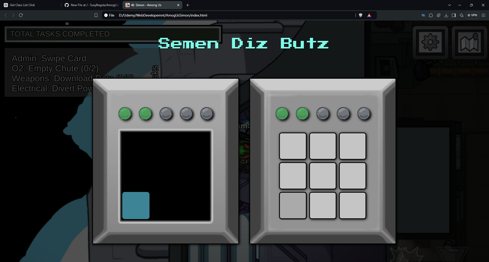

Among Us Simon Game
A fun and interactive Simon game inspired by the popular game Among Us. Players must follow an increasingly complex pattern of lights and sounds to progress through the levels. Make it through 5 levels to win the game, but be careful—one wrong move and you'll have to start over!

Features
Pattern Matching: Follow a sequence of lights and sounds to advance through each level.
Dynamic Levels: Each new level adds a new step to the previous pattern.
Audio Feedback: Get immediate audio feedback for both correct and incorrect inputs.
Light-Up Boxes: Watch the boxes light up as part of the pattern and upon user interaction.
Game Over & Restart: If you guess the pattern incorrectly, the game resets with a new pattern.

How to Play
Start the Game: Click anywhere on the screen to start.
Watch the Pattern: The boxes will light up in a specific sequence. Remember the pattern!
Repeat the Pattern: Click the boxes in the same order as they were lit.
Advance Through Levels: Each level adds one new box to the pattern. Reach Level 5 to win!
Reset on Failure: If you guess incorrectly, the game will reset and you can try again.

Installation
To play or work on the game locally:

Clone the repository:
git clone https://github.com/yourusername/among-us-simon-game.git

Open the index.html file in your browser to start the game.

Requirements
Basic HTML, CSS, and JavaScript knowledge for understanding the codebase.
jQuery library for DOM manipulation.
Audio Files
Panel.mp3: Plays when a box lights up in the pattern.
PanelFail.mp3: Plays when the user guesses incorrectly.
Click.mp3: Plays when the user clicks on any box.

Screenshots

